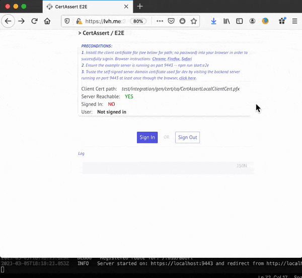

# CertAssert
A Ready-to-go solution for an OpenID Connect Provider using Certificate-Bound tokens to simplify user authentication flows build around x509 certificates.

<div align="center"></div>

## Motivation
In-house x509 infrastructure is used more and more within the industry for authentication purposes. A well managed mutual x509 infrastructure has many advantages compared to a traditional username/password scheme. Examples of these advantages are: seperation of roles, no transmission of authentication secrets due to PKI, centralised management, strong non-repudiation and more seamless authentication experiences for users.

The development of new experiences for users that is required to be build on existing mutual TLS infrastructure can become problematic. Examples of problems that can arise are: Duplication of CA certificates on new server instances, and incapability of leveraging serverless architecture offered by various cloud providers not supporting the desired authentication scheme.  

CertAssert addresses these problems by offering a ready-to-go solution for said problems by generating Certificate-Bound tokens, as documented in <a href="https://tools.ietf.org/html/rfc8705">RFC8705</a>. CertAssert builds on the <a href="https://github.com/panva/node-oidc-provider">node-oidc-provider</a> and eases the setup for a successfull integration with existing mutual TLS infrastructure and OIDC. Simply specify the OIDC clients, paths to a domain certificate and trusted CAs, JWTs and you're up and running. A default set of user interfaces is provided by CertAssert, yet all flows are configurable.

## Integration
CertAssert works standalone when configured and integrated into your environment. There are however further integrations that can be carried out, for example to fit your mutual TLS infrastructure seamlessly with cloud platforms. AWS Cognito for example facilitates the creation of User Pools based on OIDC providers, as shown below.

<div align="center"><p><i><sub>Source: <a href="https://docs.aws.amazon.com/cognito/index.html">AWS Cognito documentation</a></sub></i></p></div>

Linking AWS Cognito with an instance of CertAssert enables authenticated users with AWS role-based access control using STS *sts:AssumeRoleWithWebIdentity*. This can fullfill requirements such as AWS console access, reading the content of private AWS S3 buckets, calling private endpoints on AWS API GW etc.

## OIDC mapping
CertAssert offers client applications the option to request access for two oAuth scopes apart from the required *openid* scope. The claims associated with each oAuth scope refer to x509 attributes of the subject's distinguished name. CertAssert thus maps conventional scopes onto x509. The table below shows the details and associated claims for both scopes.

| Scope       | Claim       | Description |
| ----------- | ----------- | ----------- |
| profile | CN | Common Name
| profile | C | Country
| profile | O | Organisation
| profile | ST | State/Province
| profile | L | Locality
| email | emailAddress |

Note that some of these claims refer to x509 attributes that may not be defined for certificates that were used when the user signed in. In this case, the claim is simply ignored and not made part of the generated ID token. 

The *sub* attribute in idtokens that are generated for authenticated users refers to the SHA-256 hash of the x509 client certificate that was used when signing in. This is a unique certificate property which makes it suitable to for the *sub* attribute.

## Run the example
Issue the following two commands:
```
npm install
npm run start:e2e
```
This will spin up a fully working e2e example including an example OIDC client application which uses the *authorization_code* flow to signin. Follow the on-screen instructions of the example OIDC client application: 
* trusting the example generated self-signed certificates
* and installing the example client certificate in your browser. 

Wait for the OIDC provider to be up and running, as indicated by the 'Server reachable' flag on the example client application that is launched as well. Now you can sign-in and out of CertAssert.

NOTE that your platform will need to support a *lvh.me* mapping to *localhost*, since *localhost* is not an allowed hostname when using implicit grant types, see <a href="https://openid.net/specs/openid-connect-registration-1_0.html">openid-connect-registration</a> for more details.

## Lib usage
The lib can be build with the following command:
```
npm run build
```

If you want to run a CertAssert instance from the build lib (dist folder), first generate bootstrap an example environment.
```
npm run start:example:bootstrap
```

A JS example of using the fully build library is shown below. This is all that's needed to spin up an instance of CertAssert based on the artifacts generated during bootstrapping.
```javascript
const certassert = require('./dist');
const fs = require('fs');
const path = require('path');
const config = {
    acceptedCAs: ['test/integration/gen/cert/ca/CertAssertLocalCA.pem'],
    serverCertificatePath: './test/integration/gen/cert/server/certassertServerCert.pem',
    serverCertificateKeyPath: './test/integration/gen/cert/server/certassertServerCert.key',
    oidcIssuer: 'http://lvh.me',
    httpRedirectPort: 8080,
    securePort: 9443,
    logLevel: certassert.CasLogLevel.DEBUG,
    cookieKeys: ['a393f7c7d23b'],
    webKeys: [fs.readFileSync(path.resolve(__dirname, 'test', 'integration', 'gen', 'cert', 'signing', 'certassertSigningKey.key')).toString('utf-8')],
    clients: [
        {
            client_id: 'cert-assert-example-client-app',
            grant_types: ['implicit', 'authorization_code'],
            response_types: ['id_token', 'code'],
            redirect_uris: ['https://lvh.me:3000'],
            post_logout_redirect_uris: ['https://lvh.me:3000'],
            token_endpoint_auth_method: 'none'
        }
    ]
}
new certassert.CertAssert(config).init();
```

## Storage
Solley in-memory stores are currently supported by CertAssert. Meaning storage is non-persistent and session, interaction and certificate information cannot be used in a distributed fashion. Full integration with various DB engines will need to be implemented by the developer using this lib. Perhaps an abstraction to support popular DB engines will be provided in the future. Leaving the distributive argument aside, persistent storage for the information of CertAssert is arguably less critical since the actual authentication assets reside with the user. There is no need for storing user authentication information, as authentication follows through PKI.  

## API
Mapping of claims to x509 Distinguished name attributes.
| path        | Description |
| ----------- | ----------- |
| /api/whoami | Returns the distinguished names of the x509 client cert the user has selected for the CertAssert instance. |
| /api/auth | Returns true if the user's x509 client cert can be authenticated against any of the trusted CAs, returns false otherwise. |
| /api/list | Returns a list of distinguished names of the trusted CAs. |
| ^/signin/<interaction>     | User signin journey. |
| ^/consent/<interaction>?client=<clientId>&scopes=<scope1,scope2...>     | User consent journey. |
| ^/logout/<interaction> | User logout journey. |
| /oidc/* | OIDC related endpoints (e.g. */me,/introspection,/token*) as provided by <a href="https://github.com/panva/node-oidc-provider">node-oidc-provider</a>  |
| /:uid | Session start |
| /:uid/login | Endds login journey for particular session |
| /:uid/confirm | Ends confirm journey for particular session |
| /:uid/continue | Continue journey for particular session **depends on oAuth flow** |
| /:uid/abort | Resolves abort journey for particular session |
| ^/* | Non existing paths and errors (e.g. nonexistent sessions) end up in the error journey as defined in *interactionPaths* in your CertAssertConfig. |

^ Can be overriden using *interactionPaths* in your CertAssertConfig instance.

## Options
Most of fields of the CertAssertConfig should be self-explanatory if you're familiar with oAuth and OIDC. The customisation options offered by the config are described in this section.

### Token expiry
CertAssert uses custom token generation and adheres the expiry based on the lifetime of the client certificate the user used during authentication. Expiry intervals for the various token types can be configured through *CertAssertConfig*, however the expiry interval can get limitted by the expiry dates associated with the actual authentication asset, i.e. the client certificate. As such, the security model build around the mutual TLS infrastructure is not broken. No token will be issued that spans the lifetime of the associated client certificate.   

### Custom UI journeys
CertAssert ships with default UI journeys for the user. However, you can customised these by defining the *interactionPaths* field of the CertAssertConfig. For each user journey (signin, consent, abort etc) you can define the path where the server instance should point the user to. 

### Client configuration
OIDC client apps can be configured in the *clients* field of the CertAssertConfig. The type definition of a client is as defined by <a href="https://github.com/panva/node-oidc-provider">node-oidc-provider</a>.

### Transparent interactions (no user prompts)
One could consider the user's selection of a client certificate upon prompt in the browser during the TLS handshake as the 'consent' in terms of federated sign-in. CertAssert can accomodate this by defining the *transparentInteractionFlows* field. For each interaction (sign-in, consent etc) a transparent flow can be activated by setting it's value to *true* (default = *false*). If true, an interaction will instantly progress without any user intervention.

**BE CAREFUL with this feature.** Using transparent flows effectively lowers explicit user-consent from the application layer to the transport layer (TLS handshake). This can have implications on the user as he/she will not be exposed to consent details applying to the application level, e.g. the OIDC client ID. In other words, the user may not be aware which OIDC client application is given access to particular scopes.   